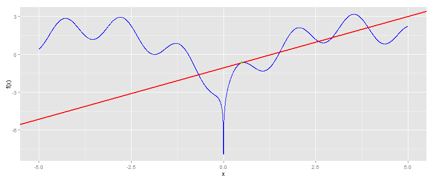

## Function and Derivative Grapher

1. Edit YAML front matter
2. Write using R Markdown
3. Use an empty line followed by three dashes to separate slides!

--- .class #id 

## Input Panel

$x^2$ 

    

--- .class #id 

## Output Panel

Plot of f(x) = sin(x^2) for x between -5 and 5:   
The derivative of f(x) at (0.5, 0.247) is 0.969   
 

--- .class #id 

## About Screen

